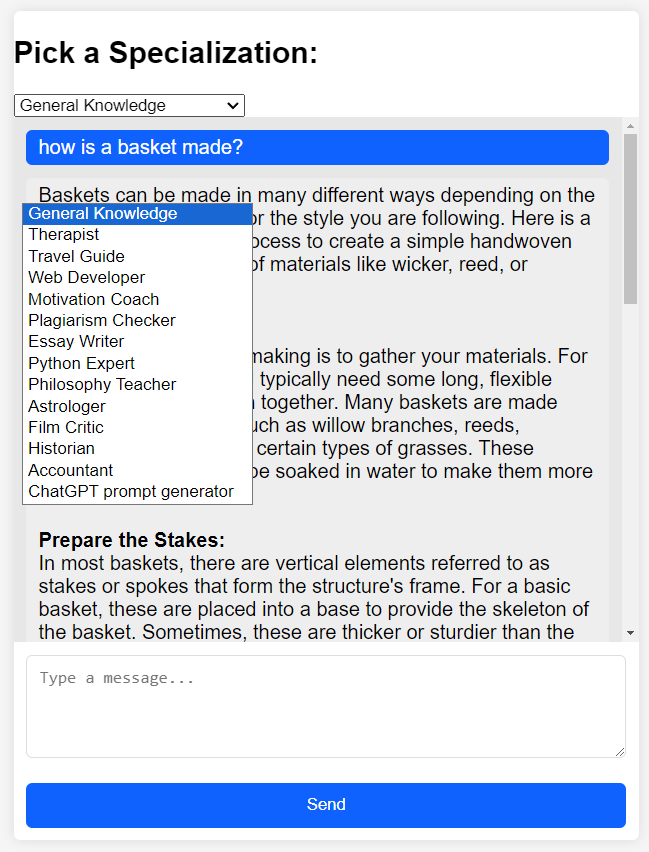

# Chatbot with Custom Prompts

This project is a Flask-based chatbot that uses OpenAI's GPT models to answer queries based on custom prompts. The application allows users to select a specialization context for the chatbot and interact with it through a web interface.

## Note From Sage
Hi all :)

I am not a developer of python. I do ok with html and css. But I've been spending a lot of time experimenting with other people's bots.

I've put together a very simple bot that pulls from a bunch of pre-defined prompts. You just select the prompt you want to use from a drop-down box and then go to town.

You can also easily add your own prompts. I've actually created a prompt for a prompt builder. It has been working pretty nicely. A lot of these prompts are from that prompt.

I wanted something that was SUPER EASY to work with. It's just written in Flask. There are only 4 files:
- app.py is the main app.
- templates/index.html is the front-end of the bot
- static/styles.css is the css.
- data.json is the prompt file. Feel free to modify those or add your own. Just don't forget to add them to the drop-down box in index.html

I built this mostly with the help of ChatGPT 4. I don't know anything. It could be a worm-hole to destroy the universe for all I know. So use it at your own risk.

Here's what it looks like:




## Setup Instructions

Follow these steps to get the chatbot up and running on your local machine.

### Prerequisites

- Python 3.x
- pip (Python package manager)
- Virtual environment (optional but recommended)

### Installation

1. Clone the repository to your local machine:

```bash
git clone https://github.com/sagerock/Nov2023Chatbot
cd your-repository-name
```

2. (Optional) Create and activate a virtual environment:

```bash
# On macOS and Linux:
python3 -m venv env
source env/bin/activate

# On Windows:
python -m venv env
.\env\Scripts\activate
```

3. Install the required Python packages:

```bash
pip install -r requirements.txt
```

4. Set the `OPENAI_API_KEY` environment variable with your OpenAI API key. This step varies depending on your operating system.

### Configuration

The chatbot uses a `data.json` file to store custom prompts. You can modify this file to include your own prompts.

#### Modifying `data.json`

The `data.json` file is structured as an array of prompt objects, where each prompt object has a `prompt_id` and `content` field. Here's an example of how the file looks:

```json
[
  {
    "prompt_id": "general",
    "content": "Your general knowledge prompt goes here."
  },
  {
    "prompt_id": "therapy",
    "content": "Your therapy prompt goes here."
  }
  // Add more prompts as needed
]
```

To add a new prompt, simply append a new object to the array with a unique `prompt_id` and the prompt content you wish to use.

Then add your new `prompt_id` to the 'specialization-container' in index.html

### Running the Application

To start the Flask server, run the following command:

```bash
flask run
```

By default, the server will start on `http://127.0.0.1:5000`. Open this address in your web browser to interact with the chatbot.

### Customizing the Front End

The front-end code is contained within the `templates` and `static` directories. You can modify the HTML, CSS, and JavaScript files in these directories to change the appearance and functionality of the web interface.

## Usage

Once the application is running, select a specialization from the dropdown menu and type your message into the chat input. Click the "Send" button to receive a response from the chatbot.

## Contributions

If you wish to contribute to this project, please fork the repository and submit a pull request.

## License

This project is licensed under the MIT License

